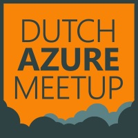

# DutchAzureMeetup

Here you'll find the instruction for the hands-on part of tonight's Meetup.

## Instructions

1. Deploy your Windows VM
2. On-board your VM on Azure Arc
    * Use the environment variable listed on this `gist` when using an Azure VM:  https://gist.github.com/TheCloudScout
3. Deploy PowerShell script
    * Find PowerShell script and ARM template for `Custom Script Extension for Windows` here:  https://github.com/TheCloudScout/DutchAzureMeetup

## First player(s) to put their name on the screen wins! 🎉

